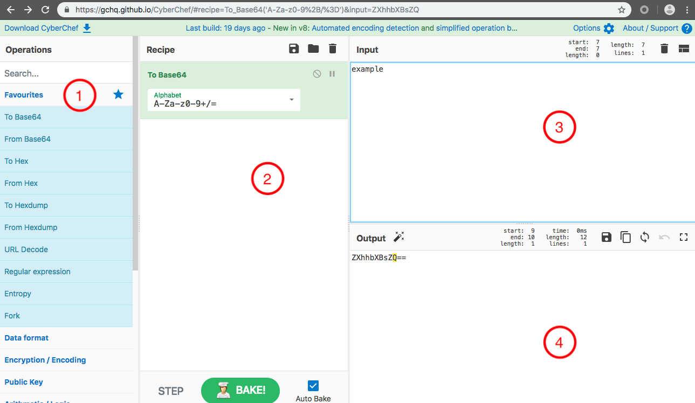
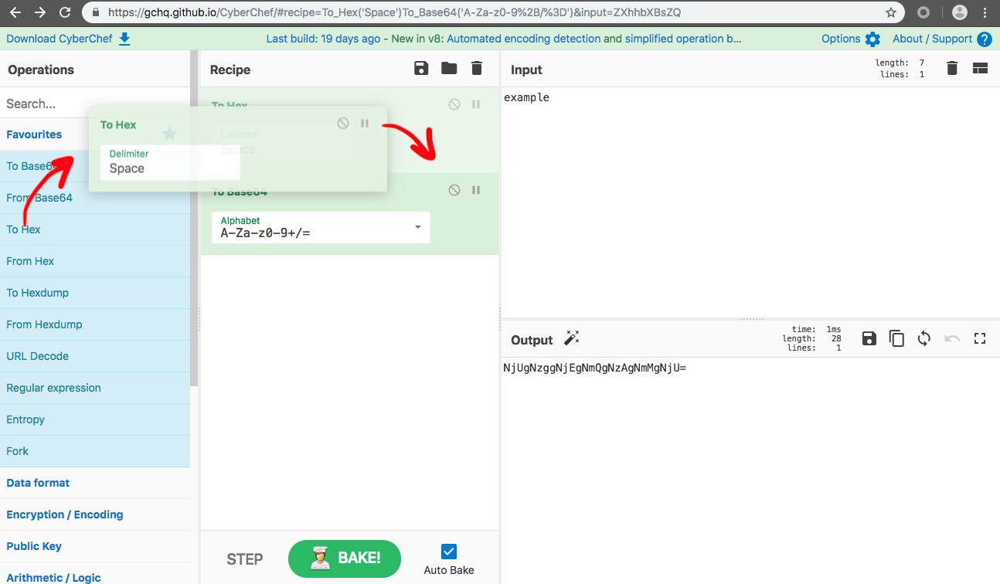

Cyber Chef
===
[Cyber Chef](https://gchq.github.io/CyberChef/) เป็น เว็บแอ็พพลิเคชันใช้สำหรับการวิเคราะห์และถอดรหัสข้อมูล โดยไม่ต้องจัดการกับเครื่องมือที่ซับซ้อนหรือภาษาโปรแกรม CyberChef สนับสนุนให้ผู้คนแม้ว่าไม่ใช่ด้านเทคนิค สามารถทำการเข้ารหัสและการบีบอัดข้อมูล รูปแบบต่าง ๆ

### Anatomy of Cyber Chef
1. Operations - เลืือกวิธีการเข้ารหัสข้อมูล ที่ต้องการจากตรงนี้
2. Recipe - การเข้ารหัสข้อมูล ที่กำลังใช้งาน ณ ปัจจุบัน
3. Input - ช่องใส่ข้อมูล ที่ต้องการเข้ารหัสข้อมูล
4. Output - ช่องผลลัพธ์ที่ได้จากการเข้ารหัสข้อมูล

## How to use it
เนื่องจาก Cyber Chef ถูกออกแบบให้ผู้ที่ไม่ใช่ด้านเทคนิคก็สามารถใช้งานได้ วิธีการใช้งานจึงง่ายดายด้วย Design แบบ Drag & Drop โดยการลากการเข้ารหัสหรือถอดรหัสที่ต้องการไปวางใน Recipe ตามลำดับการทำงานที่เราต้องการ แล้วใส่ ข้อความที่ต้องการเข้ารหัสหรือถอดรหัสในช่อง Input แล้วกดปุ่ม Bake แค่นี้ก็เป็นอันเสร็จเรียบร้อย

หวังว่าวิธีีการใช้งาน Cyber Chef นี้จะช่วยให้สามารถทำ Challenge ใน Wreck-it Lab ได้ดียิ่งขึ้นนะครับ ^_^