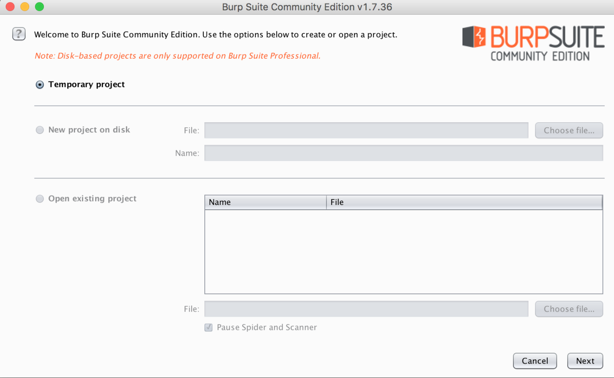
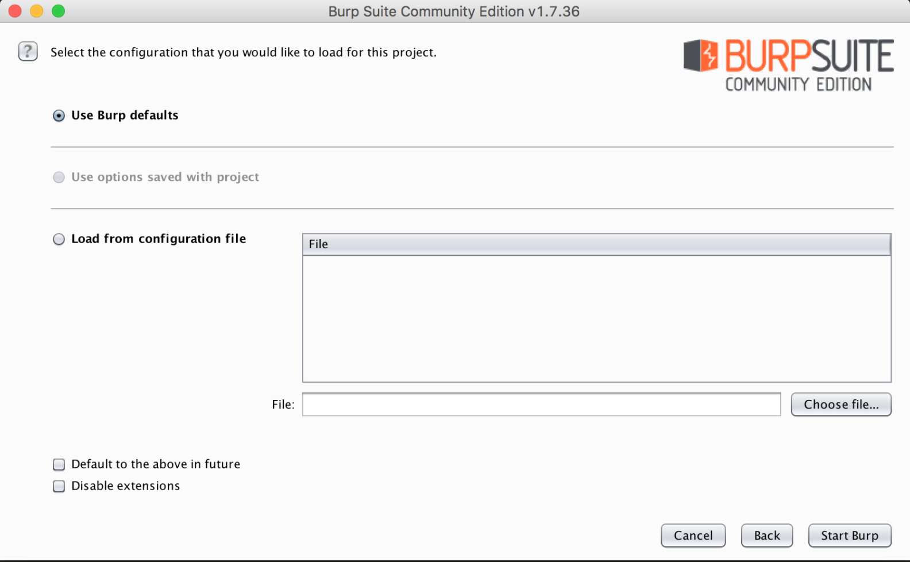
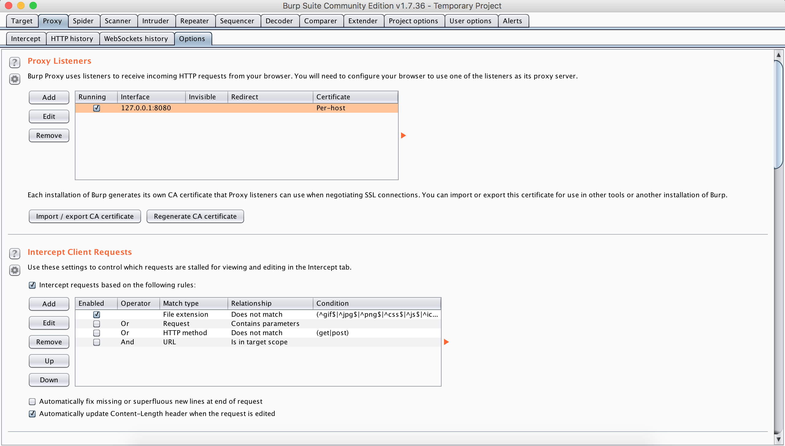
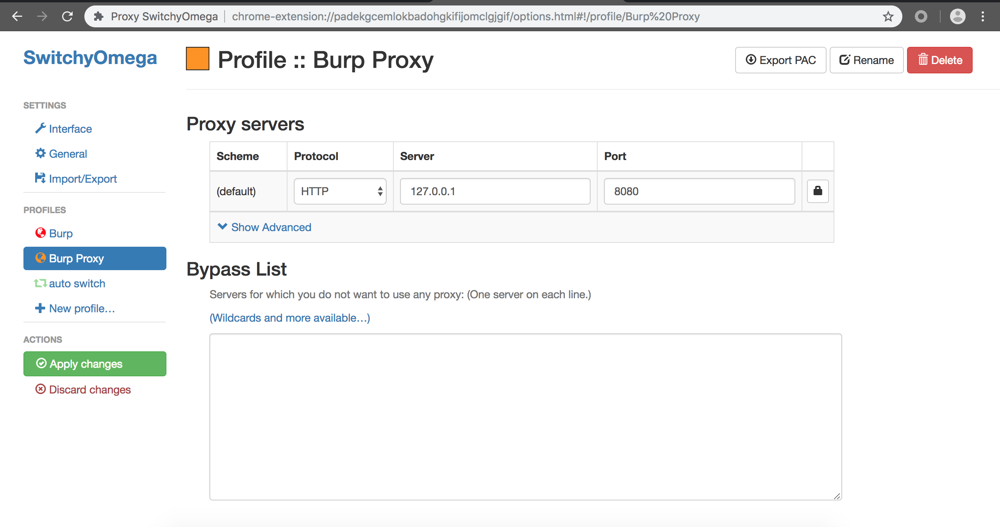
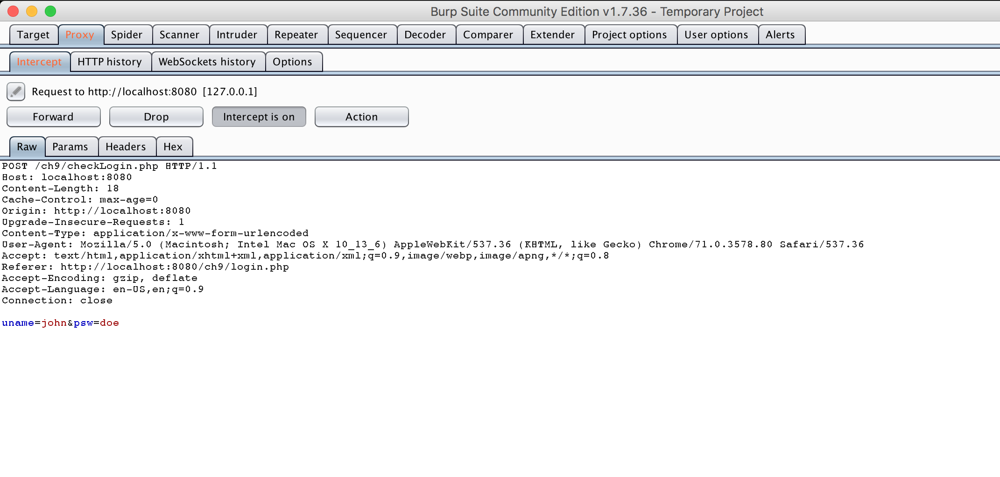
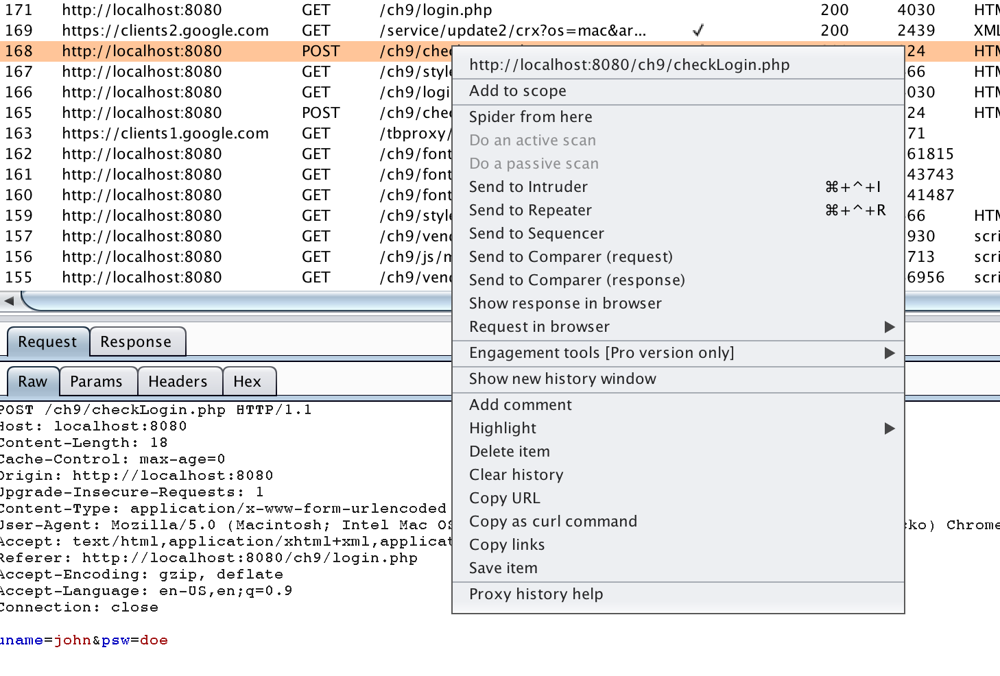

Burp Suite Community Edition
===
Burp Suite เป็นเครื่องมือที่เอาไว้สำหรับการทำ Penetration Testing โดยหลักๆแล้ว Burp Suite จะทำตัวเป็น Intercept Proxy ทำให้เราสามารถดักจับและแก้ไข HTTP Request & Response ได้ นอกเหนือจาก proxy แล้ว Burp Suite ยังมีฟังก์ชันต่าง ๆ อีกมากมาย เช่น

- **Spider**: ทำหน้าที่เป็นตัวไล่จับลำดับแต่ละลิงค์ เพื่อหาว่า web application ทำงานยังไง ไปที่ไหน ยังไงบ้าง
- **Scanner**: แกน HTTP request และหาช่องโหว่ต่าง ๆ ให้อัตโนมัติ
- **Intruder**: ทำให้เราสามารถปรับแต่งการโจมตี เพื่อใช้ในการทดสอบใน tasks ต่างๆ ได้
- **Repeater**: แก้ไข HTTP requests เพื่อทดสอบ Response ต่างๆจากเซิร์ฟเวอร์
- **Sequencer**: ค้นหา session tokens ของ application หรือ ตัวแปลที่เราต้องการ
- **Decoder**: เข้ารหัส ถอดรหัสข้อมูล
- **Comparer**: เปรียบเทียบข้อมูลแบบบิตต่อบิต เพื่อหาความแตกต่างระหว่างข้อมูล ซึ่งอาจจะมีบางอย่างที่น่าสนใจให้เราทดสอบได้

Installation
===
1. ดาวน์โหลดและติดตั้ง [Burp Suite Community Edition](https://portswigger.net/burp/communitydownload).
2. เปิดโปรแกรมขึ้นมาแล้วเลือกสร้าง Temporary project แล้วเลือก Config file เป็น Default.

3. เมื่อเปิดหน้าต่าง Burp Suite ขึ้นมาแล้ว ให้ไปที่ Proxy > Options เพื่อตั้งค่า proxy (Default ที่ 127.0.0.1:8080)

4. จากนั้นไปที่ Browser แล้วติดตั้ง SwtichyOmega Extension เพื่อตั้งค่า browser proxy (หรือจะตั้ง proxy ด้วยวิธีอื่นก็ได้เช่นเดียวกัน)
[Chrome](https://chrome.google.com/webstore/detail/proxy-switchyomega/padekgcemlokbadohgkifijomclgjgif?hl=en),
[Firefox](https://addons.mozilla.org/en-US/firefox/addon/switchyomega/).
5. เพิ่ม Profile ใหม่แล้วเซ็ตค่าดังต่อไปนี้

ลบ Bypass list ออกแล้วใส่ Host เป็น 127.0.0.1 แล้ว port ที่เปิด listening ใน Burp (Default 8080)

6. กดปุ่ม SwtichyOmega เลือก Direct แล้วเลือก Burp Proxy ที่เซ็ตเอาไว้ ตาม Host ที่ต้องการเซ็ต proxy

7. [เพิ่มเติม] หากต้องการใช้ Burp Suite ในการดัก HTTPS จะต้องลง Burp's CA Certificate ให้ Browser ด้วยวิธีการดังนี้ [Installing Burp's CA Certificate in your browser
](https://support.portswigger.net/customer/portal/articles/1783075-installing-burp-s-ca-certificate-in-your-browser)

---
Proxy
===
## Intercept Proxy
- Burp Suite มีความสามารถในการทำ Man-in-the-Middle (MITM) ถ้าหากเปิด Intercept is on เอาไว้ จะทำให้ทุก HTTP Request ถูกดักเอาไว้แล้วสามาถทำการแก้ไขได้ ก่อนจะกด Forward ไปที่ Sever ปลายทาง

## HTTP History
- Tab HTTP History จะแสดงทุก ๆ HTTP Request/Resonse ที่เกิดขึ้นทั้งหมดไว้

 และสามารถคลิกขวาที่รายการ เพื่อส่ง HTTP Request นั้น ๆ ไปยัง เครื่องมืออื่น ๆ ได้

Repeater
===
- Repeater เป็นหนึ่งในเครื่องมือที่ใช้งานง่ายและมีประโยชน์ โดยเครื่องมือนี้จะทำให้สามารถ สร้าง/แก้ไข HTTP Reqest แล้วส่งไปยัง Server ปลายทางได้สะดวกและรวดเร็วยิ่งขึ้น 

วิธีการใช้งานคือส่ง HTTP Request ที่ต้องการแก้ไขมาที่ Repeater (คลิกขวาที่ HTTP Request > Send to Repeater) เมื่อเข้ามา Tab Repeater ก็จะสามารถ แก้ไข HTTP Request ได้ตามใจ แล้วสามารถดู Response ได้ทันทีอีกด้วย

---
ทั้งหมดที่กล่าวมานี้เป็นการใช้งาน Burp Suite เบื้องต้น ซึ่งเพียงพอต่อการนำมาใช้กับ Wreck-it Lab ขอให้ทุกท่านโชคดีครับ.